AWS Cross-Region VPC Peering Project
📌 Problem Statement :
In a real-world scenario, applications are often deployed across multiple AWS regions. Secure communication between these regions is required without exposing resources to the internet.
This project demonstrates how to securely access a private EC2 instance in one region (Virginia) from another region (Singapore) using VPC Peering, without using Internet Gateway or NAT Gateway.
________________________________________
🏗️ Architecture Overview :
•	Singapore Region:
o	One VPC with:
	Public subnet (Bastion Host)
	Private subnets (Private EC2)
•	Virginia Region:
o	One VPC with:
	Two private subnets
	Two private EC2 instances (Instance A & B)
	No Internet Gateway or NAT Gateway
•	Connection:
o	VPC Peering established between Singapore and Virginia VPCs
o	Route tables updated for cross-VPC communication
o	Security groups configured for restricted access
________________________________________
📊 Architecture Diagram :

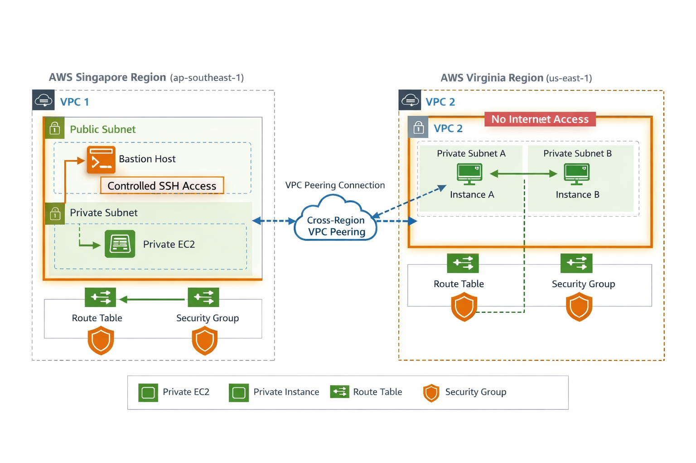

________________________________________
⚙️ Components Used :
•	Amazon VPC (2 regions)
•	Public and Private Subnets
•	EC2 Instances (Bastion + Private)
•	VPC Peering Connection
•	Route Tables
•	Security Groups
•	PuTTY (SSH access)
________________________________________
🔧 Step-by-Step Implementation :
1. Created VPC in Singapore

 
2. Created Public and Private Subnets

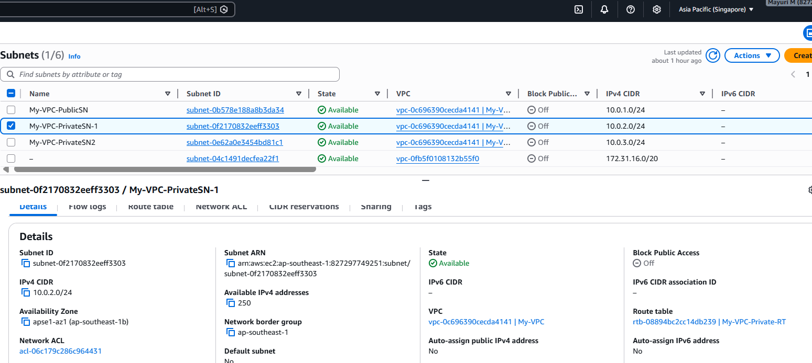

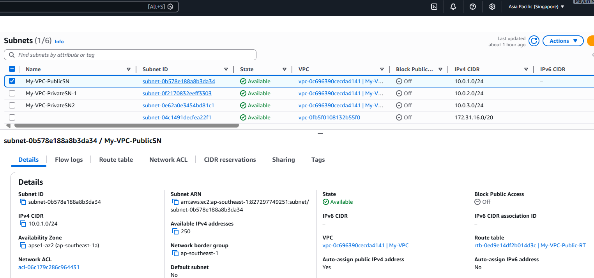
 
3. Launched Bastion Host (Public EC2)

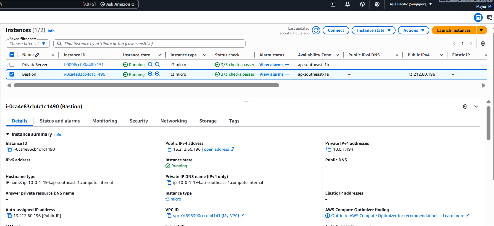
 
4. Launched Private EC2 in Singapore

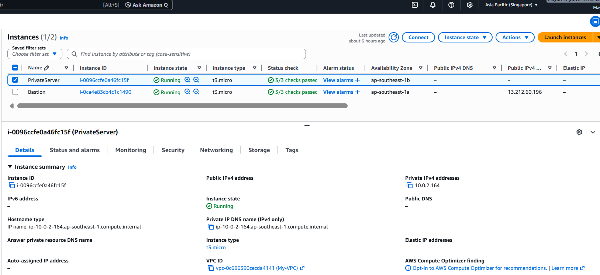

 
5. Created VPC in Virginia

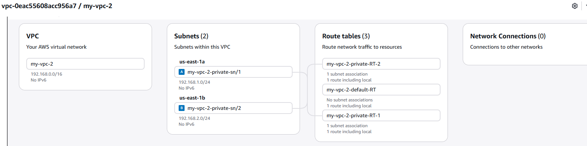
 
6. Launched Private Instances in Virginia (A & B) :

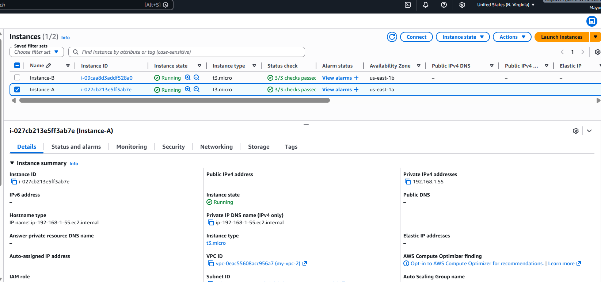

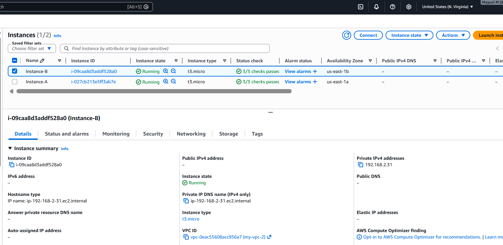

 
7. Created VPC Peering Connection 

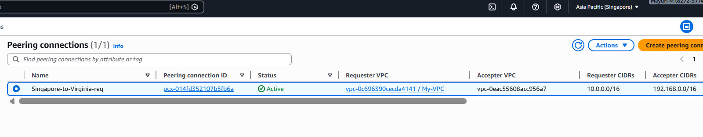
 
8. Updated Route Tables in Both VPCs 

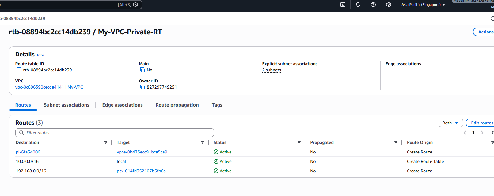

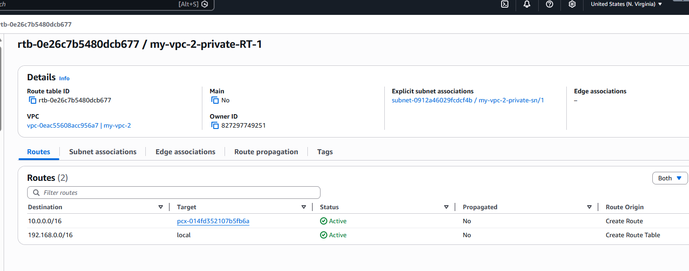

 
9. Configured Security Groups 
•	Allowed SSH access only from Singapore private instance to Virginia instance A

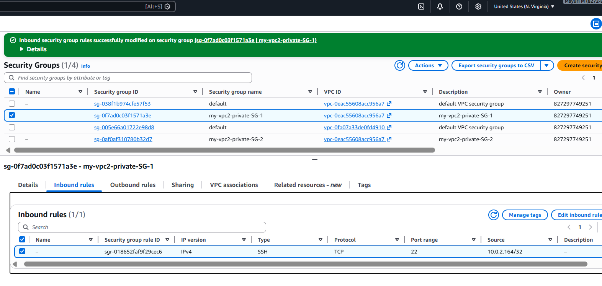

 
________________________________________
🔐 Security Design :
•	Virginia instances do not have public IPs
•	No Internet Gateway or NAT Gateway in Virginia VPC
•	Access is restricted using Security Groups
•	Only Singapore private instance can access Virginia instance A
•	Bastion host is used for controlled access
________________________________________
💰 Cost Optimization :
•	No NAT Gateway used in Virginia VPC
•	Private architecture reduces unnecessary internet traffic
•	Efficient use of AWS internal networking
________________________________________
🧪 Verification Steps :
Step 1: Connect to Bastion Host
•	Used PuTTY to SSH into Bastion Host (Singapore public EC2)
Step 2: Connect to Singapore Private EC2
•	SSH from Bastion to private EC2 using private IP
Step 3: Access Virginia Instance A
•	From Singapore private EC2, SSH into Virginia private instance A using private IP
Step 4: Validate Restricted Access
•	Verified that only Singapore private instance can access Virginia instance A
•	Other instances are restricted via Security Groups

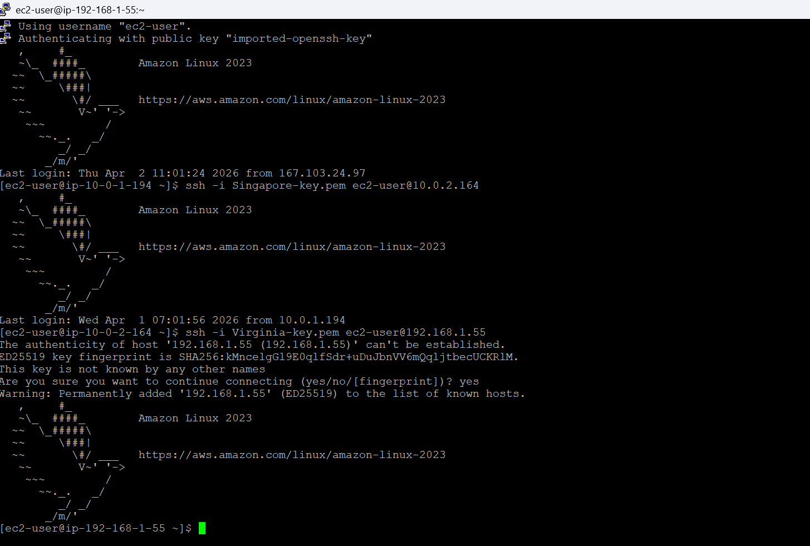
________________________________________
💡 Key Learnings :
•	Learned cross-region VPC peering setup
•	Understood routing between multiple VPCs
•	Implemented secure private communication without internet
•	Gained knowledge of bastion host architecture
•	Applied security group restrictions for controlled access
________________________________________
🚀 Conclusion :
This project demonstrates secure cross-region communication using VPC Peering. It ensures that private resources remain isolated while still being accessible in a controlled and secure manner.
